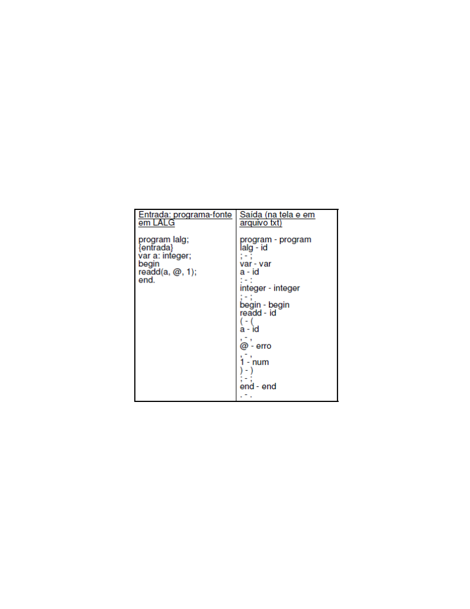
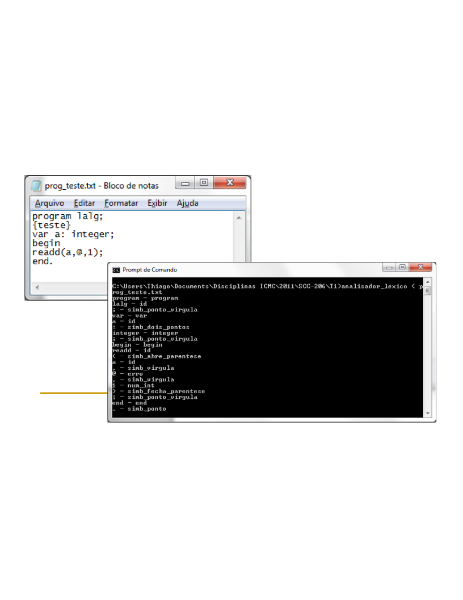
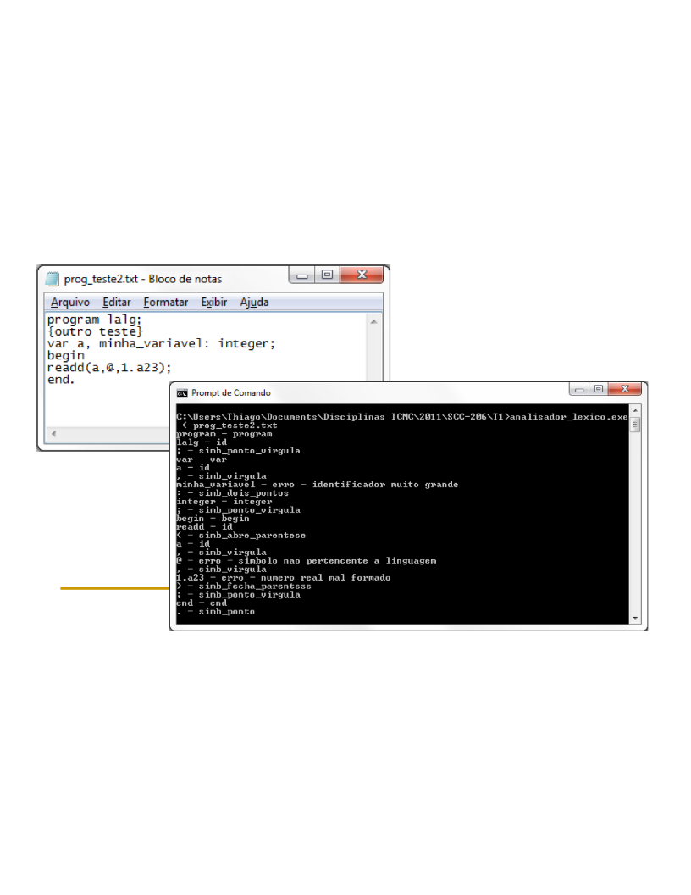

UNIVERSIDADE DE SÃO PAULO

INSTITUTO DE CIÊNCIAS MATEMÁTICAS E DE COMPUTAÇÃO

DEPARTAMENTO DE CIÊNCIAS DE COMPUTAÇÃO

Prof. Dr. Diego Raphael Amancio
diego@icmc.usp.br

Trabalho 1 - Analisador léxico

> Especificação: desenvolver o analisador léxico para a linguagem LALG, com tratamento de erro. Como exemplo, considere as seguintes entradas e saídas:

As seguintes tarefas devem ser desenvolvidas neste trabalho prático:

1. Modelar a tarefa do analisador léxico: tokens possíveis, expressões regulares utilizadas, formas de tratamento de erros (ver slides das aulas).

2. Buscar e estudar o lex/flex ou JavaCC: note que quase todos os livros de compiladores têm apresentações dessas ferramentas; também há muitos tutorias na Web (alguns estão disponíveis no site da disciplina). O grupo pode decidir por implementar o analisador de maneira manual, sem o uso das ferramentas mencionadas.

3. Gerar o analisador léxico usando o lex/flex ou javaCC: o grupo deve incorporar no lex/flex/javaCC a geração de uma função principal que analise todo o arquivo de entrada, chamando o analisador léxico várias vezes, o qual, a cada chamada, deve retornar um único par <cadeia,token>. Note que esta função será substituída posteriormente pelo analisador sintático.

Seguem mais alguns exemplos:

O grupo deve tomar as seguintes decisões de projeto:

1. <palavra_reservada,palavra_reservada> ou <palavra_reservada,simb_palavra_reservada>. Para facilitar o entendimento, não utilize códigos numéricos para os tokens.

2. Implementação da tabela de palavras reservadas: escolha da estrutura de dados e da função de busca. Note que a busca deve ser eficiente.

3. Como lidar com erros? Erros genéricos ou mais específicos?

Entrega: submissão de arquivo zip/rar no Tidia (um membro do grupo deve submeter no escaninho) até o dia 28/4/2019.

O que entregar? 

• Especificação/listagem do analisador léxico na linguagem lex/flex/javacc;
• Código fonte produzido e executável;
• Relatório sucinto informando os membros do grupo (número USP), decisões de projeto e justificativas, descrição da especificação do analisador léxico na linguagem lex/flex/javacc, passo a passo para compilar o analisador léxico e executá-lo além de um ou mais exemplos de execução.

Prazo de entrega: 28/4/2019 até meia noite. A cada dia de atraso, um ponto a menos. Se cópia identificada, zero para todos os grupos envolvidos.

Itens a serem avaliados: 

10% da nota: Clareza e completude do relatório pedido, especificação criado em lex ...
80% da nota: Análise léxica em si, com tratamento de erros. A avaliação será realizada com base em casos de teste.
10% da nota: questões de implementação que incluem acesso à tabela de palavras reservadas, presença de programa principal executando o analisador léxico várias vezes, tratamento de comentários, etc.

Dica: desenvolvam o trabalho com calma e atenção, aprimorando a especificação do lex.. e avaliando os impactos na análise léxica de casos reais.

# Trabalho Prático 2 – Análise Sintática

> Especificação:  implementar  o  analisador  sintático  para  a  linguagem  LALG,  usando  YACC  ou JAVACC. A implementação também pode ser feita manualmente.

As seguintes tarefas devem ser desenvolvidas neste trabalho prático:

1.  (Para  quem  não  implementar  manualmente)  Buscar  e  estudar  o  YACC  ou  JavaCC:  note  que quase todos os livros de compiladores têm apresentações dessas ferramentas; também há muitos tutorias na Web (alguns estão disponíveis no site da disciplina).

2.  Gerar  o  analisador  sintático  usando  o  YACC  ou  JavaCC:  substitua  o  programa  principal  do Trabalho 1 pelo analisador sintático. Corrija o analisador léxico (se necessário).

3.  Implementar  o  tratamento  de  erro  usando  o  modo  pânico,  sempre  relatando  os  erros  para  o usuário.

Atenção:

1.  A  usabilidade  da  interface  gráfica  ou  linha  de  comando  será  avaliada,  considerando  que  a interface seja intuitiva, simples e amigável.

2. A entrega será avaliada levando em consideração bons costumes de programação. Isto é:
* Documentação do código
* Variáveis e sub-rotinas com nomes significativos
* Indentação

Entrega: submissão de arquivo no tidia (escaninho) até o dia 9/6/2019.

O que entregar?
* Especificação do analisador sintático na linguagem yacc/javacc; 
* Código fonte produzido e executável;
* Relatório sucinto e objetivo informando os membros do grupo (número USP), decisões de projeto e de implementação, justificativas, visão geral dos módulos e organização do analisador sintático e   do   compilador   até   o   ponto   de   desenvolvimento   em   questão,   passo   a   passo   para compilar/interpretar o analisador sintático e executá-lo além de um ou mais exemplos de execução.

Prazo de entrega: 9/6/2019até antes da meia noite.

A  cada  dia  de  atraso,  um  ponto  a  menos.  Se  cópia  identificada,  zero  para  todos  os  grupos envolvidos.

Itens a serem avaliados:
- 10% da nota: Clareza e completude do relatório pedido, especificação criado em YACC/JavaCC.
- 80% da nota: Análise sintática em si, com tratamento de erros. A avaliação será realizada com base em casos de teste.
- 10%  da  nota:  questões  de  implementação  que  incluem  presença  de  programa  principal executando o analisador sintático várias vezes, tratamento de comentários, etc.

Dica:   desenvolvam   o   trabalho   com   calma   e   atenção,   aprimorando   a   especificação   do YACC/JavaCC e avaliando os impactos na análise sintática de casos reais.
